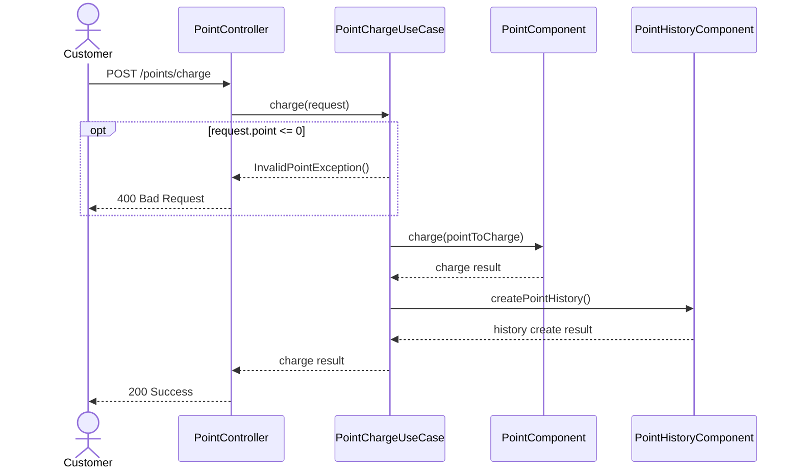
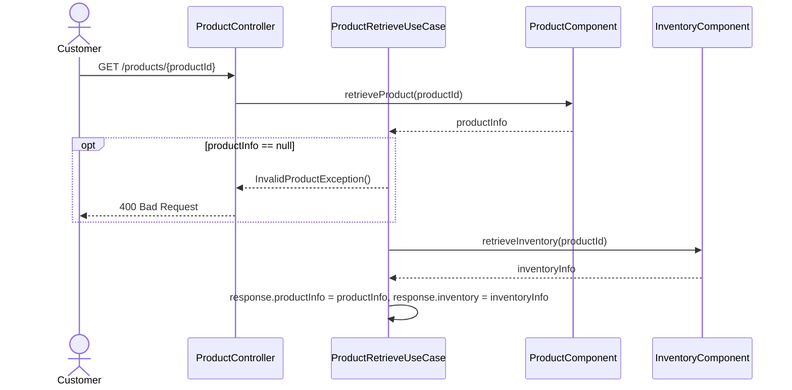
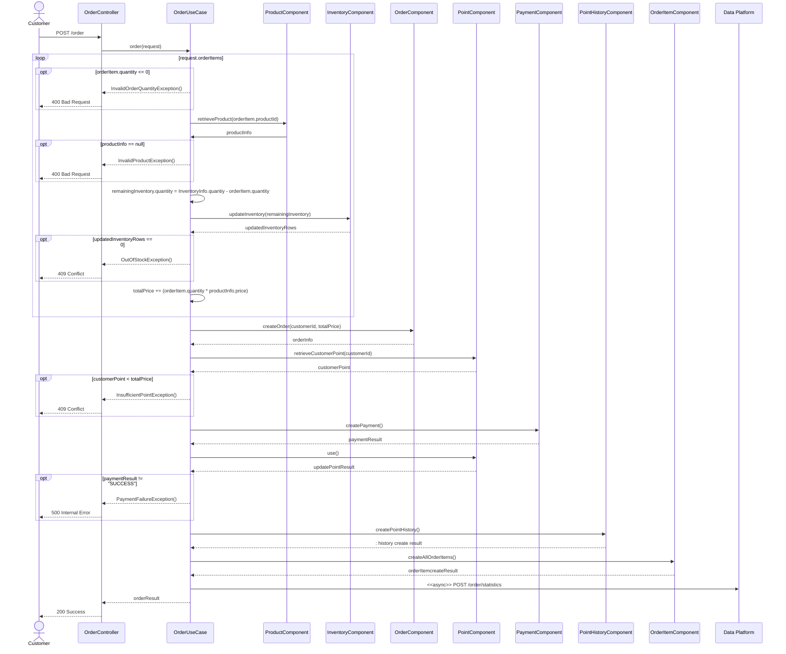
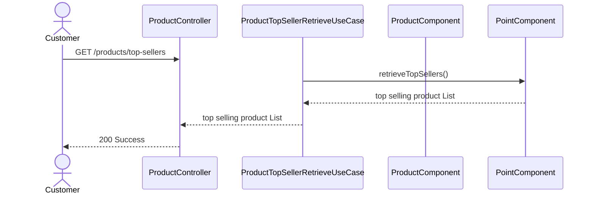
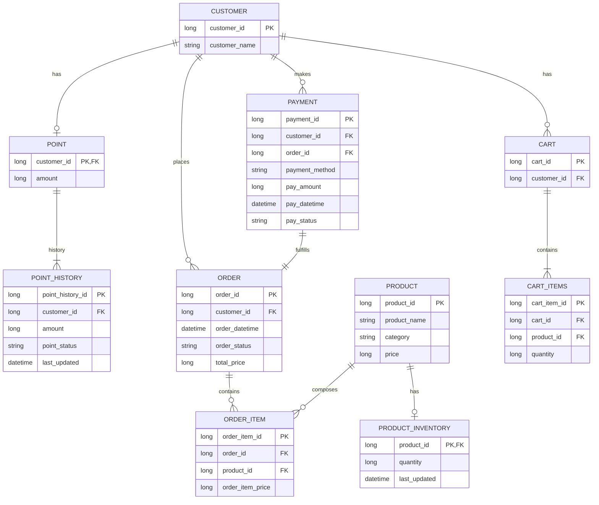

# 1. Project Overview
* 포인트 충전, 상품 조회, 주문, 결제 기능을 갖춘 간단한 e-commerce 서버
* TDD 방법론으로 개발
* 외부 API  호출
* 상품 재고에 대한 동시성 이슈 고려
> 💡 동시에 여러 주문이 들어올 경우, 유저의 보유 잔고에 대한 처리가 정확해야 합니다.\
> 💡 각 상품의 재고 관리가 정상적으로 이루어져 잘못된 주문이 발생하지 않도록 해야 합니다.

# 2. APIs
## 2-1. 포인트 충전
### 2-1-1. Requirements
* 결제에 사용될 금액을 충전하는 API 를 작성합니다.
* 사용자 식별자 및 충전할 금액을 받아 잔액을 충전합니다.
* 사용자 식별자를 통해 해당 사용자의 잔액을 조회합니다.
### 2-1-2. API 명세
| HTTP Method | URL |
| --- |---|
| POST | /points/charge |
### 2-1-3. Sequence Diagram

## 2-2. 상품 조회
### 2-2-1. Requirements
* 상품 정보 ( ID, 이름, 가격, 잔여수량 ) 을 조회하는 API 를 작성합니다.
* 조회시점의 상품별 잔여수량이 정확하면 좋습니다.
### 2-2-2. API 명세
| HTTP Method | URL |
|-------------|--|
| GET         | /products/{productId} |
### 2-2-3. Sequence Diagram

## 2-3. 주문
### 2-3-1. Requirements
* 사용자 식별자와 (상품 ID, 수량) 목록을 입력받아 주문하고 결제를 수행하는 API 를 작성합니다.
* 결제는 기 충전된 잔액을 기반으로 수행하며 성공할 시 잔액을 차감해야 합니다.
* 데이터 분석을 위해 결제 성공 시에 실시간으로 주문 정보를 데이터 플랫폼에 전송해야 합니다. ( 데이터 플랫폼이 어플리케이션 외부 라는 가정만 지켜 작업해 주시면 됩니다 )
### 2-3-2. API 명세
| HTTP Method | URL    |
|-------------|--------|
| POST        | /order |
### 2-3-3. Sequence Diagram

## 2-4. 상위 상품 조회
### 2-4-1. Requirements
* 최근 3일간 가장 많이 팔린 상위 5개 상품 정보를 제공하는 API 를 작성합니다.
* 통계 정보를 다루기 위한 기술적 고민을 충분히 해보도록 합니다.
### 2-4-2. API 명세
| HTTP Method | URL |
|-------------|--|
| GET         | /products/top-sellers |
### 2-4-3. Sequence Diagram

---
> 👨‍💻 심화 과제 : 장바구니 기능
## 2-5. 장바구니 조회

## 2-6. 장바구니 추가

## 2-7. 장바구니 삭제
# 3. ERD

* 재고에 대한 I/O가 많으므로 `PRODUCT`테이블로부터 분리하여 `INVENTORY`테이블로 관리함
* 주문 시 각 주문 상품에 대한 상태가 별도로 관리될 수 있으므로 `ORDER` 테이블과 `ORDER_ITEM` 테이블을 분리하여 관리
* 장바구니도 장바구니에 담은 각 상품별 수량, 상태 등이 관리될 수 있도록 `CART` 테이블과 `CART_ITEMS` 테이블로 분리함